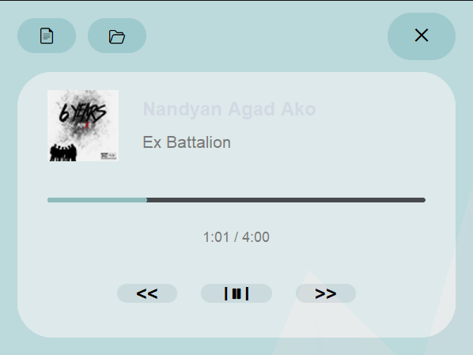

# Desktop Music Player 🎵

A minimalist, aesthetic desktop music player built with Python. Supports both local music files and Spotify playback.



## Features

- 🎨 Clean, aesthetic design with transparency
- 🎵 Local music file playback (MP3, WAV)
- 🎧 Spotify integration
- 📊 Real-time progress bar
- ⏱️ Time tracking
- 🖼️ Album art display
- 🎯 Drag-and-drop window movement
- 🎨 Transparent, modern UI

## Installation

1. Clone this repository:
```bash
git clone https://github.com/Enyzelle/desktop-music-player.git

cd music-player
```

2. Install required packages:
```bash
pip install customtkinter
pip install pygame
pip install pillow
pip install spotipy
pip install mutagen
```

3. Set up Spotify API (optional):
- Go to [Spotify Developer Dashboard](https://developer.spotify.com/dashboard)
- Create a new app
- Replace `client_id` and `client_secret` in the code with your credentials
- Set redirect URI to `http://localhost:8888/callback` in your Spotify app settings

## Usage

Run the player:
```bash
python music_player.py
py music_player.py
python3 music_player.py
```

### Controls
- 📄 View lyrics (feature coming soon)
- 📂 Open music file
- ✕ Close player
- << Previous track
- > Play/Pause (II) 
- >> Next track

### Features
- Drag the window to move it
- Double-click to select local music files
- Progress bar shows current playback position
- Time display shows current and total duration
- Album art display (Spotify) or default art (local files)

## Requirements
- Python 3.x
- customtkinter
- pygame
- pillow
- spotipy
- mutagen

## Contributing
Feel free to open issues or submit pull requests to improve the player.

## License
This project is licensed under the MIT License - see the LICENSE file for details.
